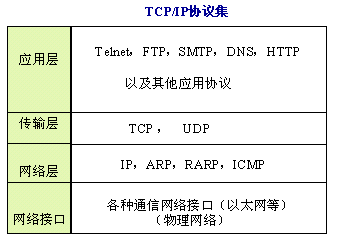
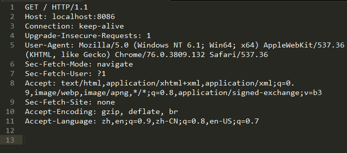
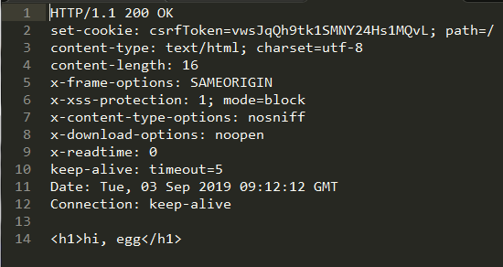

# 如何使用socket编写一个HTTP服务器
>  现在有很多开源的web服务器，如Nginx,Apache等，可以用它来做网站的服务器。但是这类webserver需要安装在性能相对较强的设备上面，然而并不是所有的小型设备都需要安装这种大型的服务，将http服务器进行轻量化,以便安装在各种平台上，例如智能灯泡，门锁等，本篇文章将探讨HTTP与TCP的关系。并尝试用socket实现一个简单的HTTP服务器。
----------


根据TCP/IP协议集图可以看出，HTTP位于应用层，而TCP位于传输层，理论上HTTP是对TCP数据的一层封装，可以用Node.js自带的net模块去试着接口下HTTP的请求，看看它的报文是什么。

```javascript
const fs = require('fs');
const net = require('net');
/** 配置项 */
const PORT = 8086;

net.createServer((socket) => {
	socket.on('data', (data) => {
		fs.writeFile("./request.txt", data, (error) => {
			if (error) {
				console.log(error);
				return;
			}
		})
	});
	socket.on('end', () => {
		socket.destroy()
	});
	socket.on('error', (error) => {
		console.log(error)
	});
}).listen(PORT, () => {
	console.log(`Socket server for text started on port ${PORT}`);
});
```
写好代码后执行，这个服务会监听8086端口这时候用浏览器去访问，会生成一个``request.txt``的文件，此时记录了下的日志信息内容是这样的。



然后参阅[RFC2616](https://www.w3.org/Protocols/rfc2616/rfc2616.html)第五章关于HTTP请求可以了解到一个请求基本包括请求行、请求头、 CRLF 至少这三部分内容，有时还有第四部分请求实体。
* 以上面的请求为例``GET / HTTP/1.1``为请求行，包含了``请求方法 ``、 ``请求URI`` 、 ``HTTP版本``等信息。
* 第二部分的请求为请求头部，最重要的特征是以``key: value``的形式出现，表示向服务器发送的请求信息。
* 请求结束后会有一行换行，可以看到第12行为空。
* 带有请求参数的POST请求会在第13行出现请求参数，可以自行去在页面中写个POST请求去试验。

这样web服务器就能接收到客户端的请求，然后服务端会发送响应报文，浏览器收到响应报文后会解析相对应的报文，然后展示页面。响应报文是怎样的，我们可以尝试使用``Eggjs``的官方示例来搭建一个web服务器，然后用这个请求报文发给服务器看看响应的报文是什么。

```javascript
const fs = require('fs');
const net = require('net');
const client = new net.Socket();
const PORT = 7002;
client.connect(PORT, '127.0.0.1', function () {
    fs.readFile('./request.txt', 'utf8', function (err, data) {
        if (err) {
            console.log(err);
            return;
        }
        client.write(data);
    })    
});
/** 响应报文输出 */
client.on('data', function (data) {
    console.log(data.toString());
    fs.writeFile("./response.txt", data, (error) => {
        if (error) {
            console.log(error);
            return;
        }
    })
})
```



可以看得出来，服务器经过解析后，在后台找到了对应的资源，于是就返回了个``HTTP/1.1 200 OK``的报文表示能正确响应报文中的内容。报文的最后一行是不是很熟悉，没错就是HTML报文浏览器就是通过解析这块区域来呈现给用户精美的界面。

了解了web服务器的大致工作原理后，编写一个简单的服务器，首先先启动TCP服务，监听端口，等到接口到HTTP请求报文后，解析请求行、请求头、请求正文的参数，根据参数找到相对应的资源或者处理相关逻辑，返回对应的响应报文给客户端，客户端就能呈现出相对应的页面出来。

* 参考文章
    * [【源码剖析】tinyhttpd —— C 语言实现最简单的 HTTP 服务器](https://github.com/AngryHacker/articles/issues/2)

