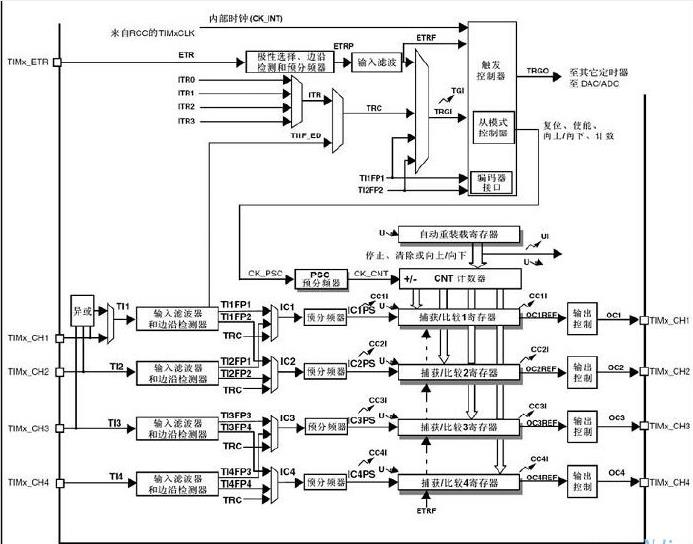
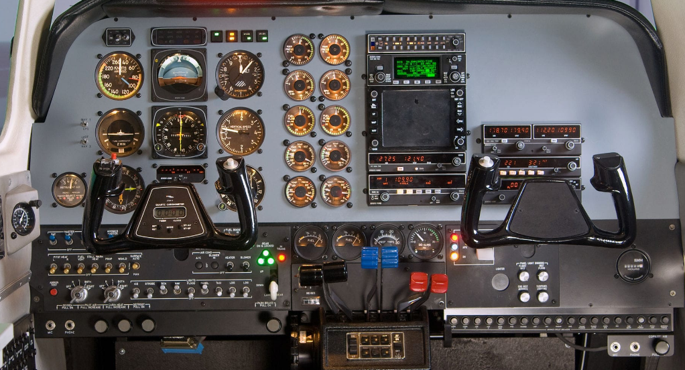

# 我与前端的历史
>  什么时候开始做前端的？又如何走上前端开发这条路的？这个涉及了很多的历史问题，本期将详细讲解是如何从一个电子信息工程专业的学生走向前端开发这条路的。
----------

首先有的人存在着这样的认知误区，电子和计算机认为是2个不同的专业。在这里要说明下，这2个专业在本科阶段所学习的专业课程是差不多。我们和计算机学院的学生基础课上都包含了C语音，数据结构和算法，计算机网络，linux，数据库，等课程，至于后面的选修课，同学们可以根据自己的情况去点相对应的技能树。再说了，如果没有电子技术的发展，怎么会有计算机这种东西呢，计算机的组成还不是由各种各样的电子原件组成。比如CPU，IO，内存，磁盘，指令集，寄存器等等，所有程序的代码都要通过CPU去读取存储设备，然后将数据放进内存中,CPU遇到相对应的汇编指令时候，将内存中的数据写入到CPU的寄存器中，通过CPU的执行相对应的操作智力（如加法运算，乘法运算）将执行结果通过接口向外输出。在本科阶段，除了必修课还有大量的选修课给同学去点自己的技能树。电子和计算机专业的很多学科都存在着互相交叉的，我们专业的的实验室有研究CV(图像处理的)，有研究网络与信息安全的，还有的研究芯片的，设想一下一个想搞AI芯片的同学至少也应该掌握一部分人工智能的知识把，而人工智能算法又属于计算机学科那边的。在国外这两个专业通常属于同一个院系。所以这2个专业的计算机基础水平都是差不多的。

最早我是做单片机开发的，使用C语言去操作各种接口，接下来发生的事情逐步改变了原来的发展通道。
1. ``始于船模``
    我们学院有一个比赛叫``船模比赛``主要是使用技术手段做出一艘船在学校的湖面上能跑一圈就可以了，不能使用现成的设备。
    由于船只需要大推力的高功率发动机，整艘船使用了4台电动机推进4个螺旋桨运行，这样整个船就有足够的马力去全速航行。

    

    但是这样会出现一个问题，每个引擎的性能会有略微的区别，且实际加工的时候也不是完全对称，4个螺旋桨同时启动，由于力矩不同的原因，有的快有的慢会导致整条船以倾斜的角度前进而不是直线。解决推力不平衡的问题势在必行。

    首先要解决的是调速问题，在STM32上本身就有pwm输出，可以通过修改4个寄存器的值来修改引擎的输出功率，通过调整功率和功率曲线，实现最终的平衡

     

     但是如何修改这个值呢，由于芯片I/O数量有限，而且实验室硬件旋钮的质量差，经常出现各种故障，同时过多的物理按键会使得操作面板变得复杂，最终整个控制台像这样子

     

     于是想到了用软件控制来解决掉这个问题，将那些速度，电压，以及一些控制属性转移到GUI界面上，用软件按钮取代实体硬件。将调整的重任搬到了软件上。

     这里又引入了其他的问题，到底要用什么技术方案好呢，最初计划使用MFC+蓝牙+串口技术上虽然简单，但是这里存在一个严重的问题，蓝牙的距离太短了。后面用WIFI来解决传输距离短的问题，但是WIFI所用的协议是TCP/IP协议，所以需要有个TCP/IP能够相对应的客户端来解决这个问题。

     后来官方的一个socket通信示例告诉我该如何去做这个客户端，但是以其编写一个socket客户端，不如直接用现成的浏览器作为客户端。 
     >  为什么选择浏览器做为客户端？

     当时主要是看到web端强大的跨平台能力，网页既可以在电脑上用，又可以在手机上用，而且只需要同一套代码就能完事。真正实现了``Write Once, Run Anywhere``。而且web跨平台能力可以不用带着笨重的电脑去现在调试，手机就能完成，这大大增强了便利性。
     
     ----------

     但是例子给的是TCP/IP协议，要把它呈现在网页上需要转为HTTP协议，怎么办？学过计算机网络都知道HTTP为应用层，在传输层上方，所以对传输层的数据进行封装就可以做个web服务器，报文格式可以通过编写程序去访问现成的web服务器得到。详情可以看[如何socket 简单实现HTTP服务器](https://github.com/chthollys/blog/blob/master/write_a_http_server), 在船的控制器上搭建一个服务器，通过请求参数来改版各个引擎的输入输出参数，最终改版船只整体的动力输出。

1. ``发展壮大``
如果说船模只是前端的开始，那么随后的工作就是将前端发展壮大。
>  首先先要感谢Node.js的出现，它的出现使得前端不再受制于浏览器本身的限制，而是可以和其它后台语言一样，能够直接操作文件系统，网络等。更重要的是有了Node后很多提高前端工作效率的工具如雨后春笋般出现，前端也不仅仅是个写界面的问题，变成了一个工程化的岗位。

临近毕业的时候，来到一家公司实习，才接触到了前端工程化这个概念，前端不仅仅是显示界面，还是一个工程问题，如何使用分治的思想去管理一个项目，如何与产品，后台去合作，一起出一个完整的项目，如何开发微信公众号。虽然后面离开了这家公司，但是这也是在技术上和其他软实力提升最快的时期，后面会专门开一个章节讲述在工程化方面的发展历程。

1. ``展望未来``
现在人工智能，机器学习的概念非常火热，这与前端有什么关系呢？在工作接近3年后，逐步进入了一个瓶颈期，随着时间的推移，发现越来越多的工作具有重复，机械式的劳动，如页面布局等等。使用机器学习的手段也许能把设计文稿自动生成对应的排版代码，但是现阶段虽然有但是也存在着局限性。也许未来的某一天，人工智能能帮助我们完成绝大部分的工作，这样就能腾出更多时间做更有意义的事情。另一方面，我也在努力地拓宽前端技术的应用场景范围。使之不再受制于之前各种各样的限制。